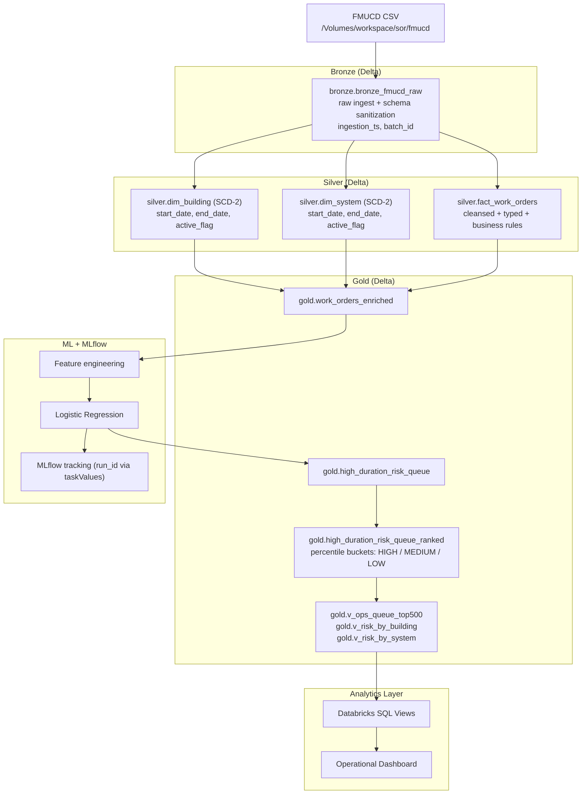

<div align="center">

# Facility Maintenance Analytics — FMUCD Databricks Capstone

[](https://databricks.com/)
[](https://www.python.org/)
[]()
[]()
[]()
[]()

**An end-to-end Databricks Lakehouse solution for predicting and prioritising long-duration maintenance risk across facility work orders.**

</div>

---

## Problem Statement

Facilities management teams handle millions of work orders every year. A small subset of those work orders become long-running, operationally disruptive, and costly — yet there is no systematic mechanism to identify them early.

This project addresses that gap directly: using the Facility Management Unified Classification Database (FMUCD), it builds a production-grade Databricks pipeline that ingests, cleanses, models, and scores work orders — surfacing a ranked risk queue that enables maintenance teams to intervene before a work order escalates.

> The objective is not prediction in isolation. It is a reliable, daily-operational risk queue that a maintenance manager can act upon.

---

## Solution Architecture



---

## Key Engineering Capabilities Demonstrated

| Area | What Was Built |
|---|---|
| **Medallion Architecture** | Bronze → Silver → Gold as production-grade operational contracts |
| **Delta Lake** | ACID transactions, schema enforcement, idempotent ingestion |
| **Dimensional Modelling** | SCD Type-2 dimensions (`dim_building`, `dim_system`) with `start_date`, `end_date`, `active_flag` |
| **Fact Table Design** | `fact_work_orders` with cleansed types, derived fields, and business rule enforcement |
| **ML Engineering** | Logistic Regression with feature engineering, time-based evaluation, MLflow tracking |
| **Experiment Tracking** | MLflow run_id passed across workflow tasks via Databricks `taskValues` |
| **Risk Operationalisation** | Percentile-based ranking (HIGH / MEDIUM / LOW) decoupled from raw ML probability calibration |
| **Unity Catalog Governance** | Catalog `fmucd_capstone`, schema boundaries, Volume-backed ingestion |
| **Pipeline Orchestration** | Databricks Workflow with sequential task dependencies and idempotent re-runs |
| **Analytical Views** | SQL views for ops queue, building risk, and system risk — designed for dashboard consumption |

---

## Dataset

**Source:** Facility Management Unified Classification Database (FMUCD)

| Attribute | Detail |
|---|---|
| Total work orders | ~2.6 million |
| Usable duration records | ~1.6 million |
| Ingestion path | `/Volumes/workspace/sor/fmucd/Facility Management Unified Classification Database (FMUCD).csv` |
| Catalog | `fmucd_capstone` |
| Key fields | Work order ID, building, system, component, priority, open date, close date, duration |

---

## ML Model

| Attribute | Detail |
|---|---|
| Algorithm | Logistic Regression |
| Label definition | Top 10% duration within (`system_code`, `wo_priority`) group |
| Evaluation metric | AUC ≈ 0.56 |
| Scoring approach | Percentile-based risk bucketing (not raw probability thresholds) |
| Tracking | MLflow — parameters, metrics, model signature, artifact logging |

**Why percentile bucketing over raw probability thresholds:**
Raw logistic regression probabilities were poorly calibrated against this dataset. Percentile ranking produces a stable, business-friendly queue — HIGH risk always represents the top 1% of work orders, regardless of model calibration drift over time. This is the correct engineering decision for an operational use case.

---

## Risk Distribution

| Risk Bucket | Threshold | Approximate Volume |
|---|---|---|
| HIGH | Top 1% | ~26,000 work orders |
| MEDIUM | Top 5% | ~106,000 work orders |
| LOW | Remaining | ~95% of all work orders |

---

## Key Findings

- Certain facility systems (`system_code`) consistently dominate the HIGH-risk queue — indicating systemic deferred maintenance rather than isolated incidents
- Buildings with high deferred maintenance history correlate strongly with elevated risk scores
- Reactive work orders (UPM) carry significantly higher long-duration risk than planned preventive maintenance (PPM)
- The ML score functions best as a **ranking signal for triage**, not a binary pass/fail classifier

---

## Prerequisites

| Requirement | Notes |
|---|---|
| Databricks Workspace | Community Edition or higher |
| Unity Catalog | Required — catalog `fmucd_capstone` must be provisioned |
| FMUCD Dataset | Upload CSV to the Volume path defined in `conf/config.yaml` |
| Python 3.x + PySpark | Provided natively by the Databricks runtime |
| MLflow | Included in Databricks runtime |

---

## Repository Structure

```
fmucd-facility-maintenance-analytics/
├── notebooks/
│   ├── 01_bronze_ingest.ipynb       # Raw CSV ingestion + schema sanitization
│   ├── 02_silver_cleanse.ipynb      # SCD-2 dimensions + fact table
│   ├── 03_gold_aggregates.ipynb     # Enriched dataset + KPI aggregates
│   ├── 04_ml_training.ipynb         # Feature engineering + Logistic Regression + MLflow
│   ├── 05_ml_scoring.ipynb          # Full dataset scoring + percentile ranking
│   └── 06_dashboard_sql.ipynb       # SQL views for operational dashboard
├── docs/
│   ├── CAPSTONE_PLAN.md             # Project objectives and design rationale
│   ├── FINDINGS.md                  # ML results and business insights
│   └── WORKFLOW_JOB.md              # Databricks Workflow task order and config
├── conf/
│   └── config.yaml                  # Catalog, schema, and path configuration
├── screenshots/                     # Proof artifacts
├── databricks.yml                   # Databricks Asset Bundle config
├── CAPSTONE_CHECKLIST.md            # Completion status
├── requirements.txt
└── README.md
```

---

## How to Run

```
1. Provision Unity Catalog: create catalog `fmucd_capstone` with bronze, silver, gold schemas
2. Upload FMUCD CSV to the Volume path defined in conf/config.yaml
3. Import notebooks into your Databricks workspace
4. Create a Databricks Workflow — task order: 01 → 02 → 03 → 04 → 05 → 06
5. Run the workflow; each task depends on the previous completing successfully
6. Query gold.v_ops_queue_top500 for the ranked risk output
```

Full workflow configuration: [`docs/WORKFLOW_JOB.md`](docs/WORKFLOW_JOB.md)

---

## Gold Layer Outputs

| Table / View | Purpose |
|---|---|
| `gold.work_orders_enriched` | Fact + dimension join, complete analytical record per work order |
| `gold.high_duration_risk_queue` | ML-scored work orders above risk threshold |
| `gold.high_duration_risk_queue_ranked` | Percentile-bucketed risk queue (HIGH / MEDIUM / LOW) |
| `gold.v_ops_queue_top500` | Top 500 high-risk work orders for daily ops triage |
| `gold.v_risk_by_building` | Risk aggregated by building for leadership review |
| `gold.v_risk_by_system` | Risk aggregated by facility system for maintenance planning |

---

## Tech Stack

| Layer | Technologies |
|---|---|
| Platform | Databricks (Community Edition / Professional) |
| Processing | PySpark, Spark SQL |
| Storage | Delta Lake, Unity Catalog Volumes |
| Languages | Python 3.x, SQL |
| Dimensional Modelling | SCD Type-2 (PySpark-native implementation) |
| ML | Scikit-Learn (Logistic Regression) |
| Experiment Tracking | MLflow (file-backed, taskValues integration) |
| Orchestration | Databricks Workflows |
| Configuration | YAML (`conf/config.yaml`), Databricks Asset Bundles |

---

## Further Reading

- [Capstone Plan & Design Rationale](docs/CAPSTONE_PLAN.md)
- [Key Findings & Business Insights](docs/FINDINGS.md)
- [Workflow Configuration](docs/WORKFLOW_JOB.md)
- [Completion Checklist](CAPSTONE_CHECKLIST.md)
